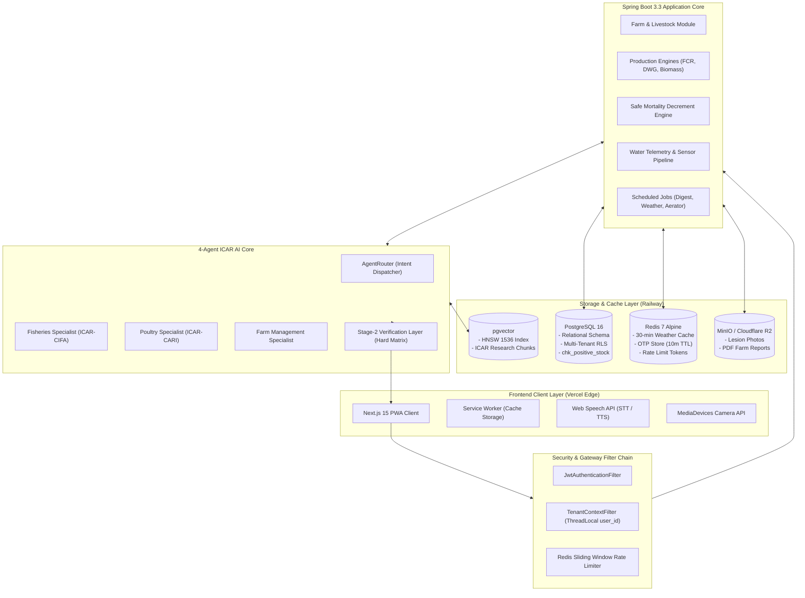

# 🏛️ AgriFarmAssistant System Architecture

> Complete, presentation-ready architectural specification for AgriFarmAssistant across all tiers.
> Fully detailed documentation, scientific threshold matrices, and database schemas are maintained in [**`docs/SYSTEM_ARCHITECTURE.md`**](docs/SYSTEM_ARCHITECTURE.md).

---

## 1. High-Level System Architecture Diagram

```text
                       📱 MOBILE BROWSER (PWA) / 💻 LAPTOP BROWSER
                     (Next.js 15 App Router + Tailwind + shadcn/ui)
                     ┌────────────────────────────────────────────┐
                     │ • Responsive: Mobile Bottom Bar / Sidebar  │
                     │ • 100% Dual-Language (Hindi & English)     │
                     │ • Camera Capture & Voice Waveform (Mic)    │
                     │ • Offline Caching (Service Worker)         │
                     └─────────────────────┬──────────────────────┘
                                           │
                                           │
                                           ▼
┌────────────────────────────────────────────────────────────────────────────────────────┐
│                        🍃 SPRING BOOT 3.3 BACKEND (Java 21)                            │
│  ┌──────────────────────────────────────────────────────────────────────────────────┐  │
│  │ 🔐 Security: Email OTP Verification + JWT (30-day) + Multi-Tenant Filter Chain   │  │
│  └──────────────────────────────────────────────────────────────────────────────────┘  │
│                                                                                        │
│  ┌───────────────────────┐ ┌─────────────────────────┐ ┌─────────────────────────────┐│
│  │  🌾 Farm & Livestock  │ │  🥣 Production Engines  │ │   📡 Telemetry & Risk       ││
│  │  • Multi-Farm (GPS)   │ │  • FCR & DWG / SGR      │ │   • Open-Meteo (30m Redis)  ││
│  │  • Fisheries Ponds    │ │  • Safe Decrement       │ │   • Nocturnal Hypoxia Alert ││
│  │  • Poultry Sheds      │ │  • 10-Day Feed Forecast │ │   • Aerator Schedule (2-6AM)││
│  │  • Vaccines & Health  │ │  • Financials (COP/kg)  │ │   • Heat Stress Comfort Idx ││
│  └───────────────────────┘ └─────────────────────────┘ └─────────────────────────────┘│
│                                                                                        │
│  ┌──────────────────────────────────────────────────────────────────────────────────┐  │
│  │ 🤖 4-Agent Multi-AI Core (Spring AI + Gemini Cascade)                             │  │
│  │  1. Fisheries AI (ICAR-CIFA)       3. Farm Management AI                         │  │
│  │  2. Poultry AI (ICAR-CARI)         4. General Agri Router                        │  │
│  │  ──────────────────────────────────────────────────────────────────────────────  │  │
│  │  🔍 Stage-2 Verification Layer (Validates against Scientific Threshold Tables)   │  │
│  │  👁️ Vision AI (Fish Fin/Scale & Poultry Lesion Detection via MinIO images)       │  │
│  │  🎙️ Multilingual Speech Engine (Hindi/English STT + TTS)                          │  │
│  │  📖 Localization Dictionaries (English & Hindi)                                  │  │
│  └──────────────────────────────────────────────────────────────────────────────────┘  │
│                                                                                        │
│  ┌──────────────────────────────────────────────────────────────────────────────────┐  │
│  │ ⏰ Scheduled Tasks: 07:00 AM Daily Morning Digest + Emergency Weather Sentinel   │  │
│  └──────────────────────────────────────────────────────────────────────────────────┘  │
└──────────────┬───────────────────────────┬───────────────────────────────┬─────────────┘
               │                           │                               │
               │                           │                               │
               ▼                           ▼                               ▼
    ┌──────────────────────┐    ┌────────────────────┐          ┌──────────────────────┐
    │ 🐘 PostgreSQL 16     │    │  ⚡ Redis 7        │          │ 🪣 MinIO S3 Storage  │
    │  • Relational Schema │    │  • 30m Weather     │          │  • Disease Photos    │
    │  • pgvector (HNSW)   │    │  • Mandi Cache     │          │  • Soil & Lab PDFs   │
    │  • Multi-tenant RLS  │    │  • Session Tokens  │          │  • Loan Reports      │
    └──────────▲───────────┘    └────────────────────┘          └──────────────────────┘
               │
               │
┌──────────────┴─────────────────────────────────────────────────────────────────────────┐
│                      🐍 PYTHON DATA & RAG ETL PIPELINE                                 │
│  • ICAR-CIFA (Fisheries) & ICAR-CARI (Poultry) Manual Parsers                          │
│  • Scientific Threshold Matrix Tables & Feed Nutritional Charts                        │
│  • Chunking, Metadata Tagging (Domain, Species, Stage) -> pgvector                     │
└────────────────────────────────────────────────────────────────────────────────────────┘
```



---

## 2. Core Architectural Components

### 2.1 Presentation Layer (Frontend PWA)
- **Framework**: Next.js 15 App Router with TypeScript & Tailwind CSS.
- **PWA Capabilities**: Service Worker (`sw.js`) for offline caching of advisory guides, app shell, and icons.
- **Speech Engine**: SpeechRecognition & SpeechSynthesis with bilingual support (Hindi & English).
- **Vision Scanner**: HTML5 `MediaDevices` API for capturing fish and poultry lesion images with client-side compression (< 1MB).

### 2.2 Security & Gateway Layer
- **Stateless Authentication**: Email OTP login with cryptographically signed 30-day JWT sessions.
- **Multi-Tenant Isolation**: `TenantContextFilter` injects validated `tenant_id` into thread-local context for strict data segregation.
- **Rate Limiting**: Redis-backed sliding-window rate limiter protecting sensitive endpoints.

### 2.3 Application Core (Spring Boot 3.3 / Java 21)
- **Domain Modules**:
  - `farm`: Multi-farm GPS geofencing and agro-climatic zone mapping.
  - `fisheries`: Pond management, polyculture stocking (Rohu, Catla, Mrigal, Pangasius, Tilapia), and water parameter monitoring.
  - `poultry`: Shed management, poultry batch tracking (Broiler, Layer, Desi, Kadaknath), and ICAR vaccination calendar.
  - `growth`: Daily Weight Gain (DWG), Specific Growth Rate (SGR), and biomass estimation.
  - `feeding`: Predictive feeding engine, 10-day forward demand model, and FCR analytics.
  - `mortality`: Concurrency-safe decrement engine preventing negative stock counts.
  - `waterquality`: Dissolved Oxygen (DO), pH, ammonia, temperature, and nitrite telemetry.
  - `health`: Clinical logs, treatment records, and withdrawal period trackers.
  - `finance`: Cost of Production (COP/kg) and farm operating expense categorization.
  - `weather`: Open-Meteo integration, nocturnal hypoxia risk predictor, and aerator scheduler (02:00 AM – 06:00 AM).
  - `email`: Resend API integration for bilingual 07:00 AM daily digests and instant storm alerts.
  - `reports`: One-click exportable PDF generator for bank loans and agricultural subsidies.
  - `tasks`: Daily checklists, morning DO checks, and in-app alert management.

### 2.4 4-Agent ICAR Multi-AI Core
- **Intent Router**: `AgentRouter` classifies queries and delegates to specialized agents:
  1. **Fisheries Specialist**: ICAR-CIFA certified protocols for freshwater fisheries.
  2. **Poultry Specialist**: ICAR-CARI standards for commercial and backyard poultry.
  3. **Farm Management Specialist**: Economic optimization, harvesting windows, and COP/kg analysis.
  4. **General Agri Router**: Emergency triage and general queries.
- **Stage-2 Verification Layer**: Programmatic Java validation ensuring chemical dosages and feeding recommendations never breach hard scientific limits (e.g., zero feeding when DO < 3.0 mg/L).

### 2.5 Data & Storage Tier
- **PostgreSQL 16**: Relational schema with multi-tenant row-level security and check constraints (`chk_positive_poultry_stock`, `chk_positive_fish_stock`).
- **pgvector**: HNSW-indexed vector store for authentic ICAR research manual chunks.
- **Redis 7**: 30-minute weather cache, OTP verification store (10m TTL), and session management.
- **MinIO / S3**: Presigned URL storage for disease diagnosis photos, lab reports, and exportable PDFs.

---

## 10. Complete Project File Alignment Map

Below is the complete, production-grade file arrangement mapping across all tiers of the platform:

```text
agrifarm-assistant/
│
├── .github/
│   └── workflows/
│       ├── backend-ci.yml                   # Spring Boot 3 test & jar build
│       ├── frontend-ci.yml                  # Next.js 15 lint, typecheck & build
│       └── docker-publish.yml               # Containerize & push to registry
│
├── docker/
│   ├── docker-compose.yml                   # Postgres (pgvector), Redis, MinIO
│   ├── Dockerfile.backend                   # JDK 21 Temurin Alpine multi-stage
│   ├── Dockerfile.frontend                  # Node 20 Alpine Next.js multi-stage
│   ├── Dockerfile.pipeline                  # Python 3.11 ETL Worker
│   └── postgres/
│       ├── init-extensions.sql              # CREATE EXTENSION IF NOT EXISTS vector;
│       └── init-roles.sql                   # Multi-tenant user schema grants
│
├── .env.example                             # Master environment template (DB, Gemini, Resend, S3)
├── Makefile                                 # Commands: make dev, make build, make ingest, make seed
├── README.md                                # Master project documentation
│
│
├── agrifarm-backend/                        # 🍃 Spring Boot 3.3 (Java 21) Backend
│   ├── pom.xml                              # Spring AI, Security, Batch, Mail, Pgvector, Redis
│   ├── mvnw
│   ├── mvnw.cmd
│   └── src/
│       ├── main/
│       │   ├── java/com/agrifarm/
│       │   │   ├── AgriFarmApplication.java
│       │   │   │
│       │   │   ├── config/                  # Infrastructure & Security Beans
│       │   │   │   ├── SecurityConfig.java         # Stateless JWT filter + Email OTP endpoints
│       │   │   │   ├── TenantContextFilter.java    # Strict Multi-Tenant user_id isolation
│       │   │   │   ├── CorsConfig.java             # Responsive Laptop & Mobile Web origins
│       │   │   │   ├── SpringAiConfig.java         # Gemini 1.5 Pro/Flash + ChatClient config
│       │   │   │   ├── VectorStoreConfig.java      # PgVectorStore with HNSW index config
│       │   │   │   ├── RedisCacheConfig.java       # Cache manager for 30-min weather TTL
│       │   │   │   ├── MinioConfig.java            # MinIO client for disease photos & PDFs
│       │   │   │   └── MailConfig.java             # Resend API / JavaMailSender config
│       │   │   │
│       │   │   ├── common/                  # Cross-Cutting Shared Layer
│       │   │   │   ├── exception/
│       │   │   │   │   ├── GlobalExceptionHandler.java
│       │   │   │   │   ├── TenantViolationException.java
│       │   │   │   │   ├── StockUnderflowException.java   # Prevents negative mortality count
│       │   │   │   │   └── ThresholdBreachException.java
│       │   │   │   ├── response/
│       │   │   │   │   ├── ApiResponse.java        # Standard { success, message, data, timestamp }
│       │   │   │   │   └── PageResponse.java       # Pagination metadata
│       │   │   │   └── util/
│       │   │   │       ├── GeoLocationUtil.java    # Lat/Long distance & agro-climatic zone
│       │   │   │       ├── GrowthCalculator.java   # SGR, DWG, and Biomass formula utilities
│       │   │   │       └── AudioConverterUtil.java # Audio format conversion for speech processing
│       │   │   │
│       │   │   ├── modules/                 # 📦 Feature-Driven Domain Architecture
│       │   │   │   │
│       │   │   │   ├── auth/                # 🔐 Feature 1: Email OTP Login & Security
│       │   │   │   │   ├── controller/AuthController.java
│       │   │   │   │   ├── dto/
│       │   │   │   │   │   ├── SendEmailOtpRequest.java
│       │   │   │   │   │   ├── VerifyEmailOtpRequest.java
│       │   │   │   │   │   └── AuthTokenResponse.java
│       │   │   │   │   ├── model/User.java, EmailOtpToken.java, Role.java
│       │   │   │   │   ├── repository/UserRepository.java, EmailOtpRepository.java
│       │   │   │   │   └── service/
│       │   │   │   │       ├── AuthService.java
│       │   │   │   │       ├── EmailOtpService.java     # Zero-SMS dependency, 6-digit OTP
│       │   │   │   │       └── JwtTokenProvider.java    # 30-day cryptographically signed JWT
│       │   │   │   │
│       │   │   │   ├── farm/                # 🏡 Feature 2: Multi-Farm & GPS Management
│       │   │   │   │   ├── controller/FarmController.java
│       │   │   │   │   ├── dto/FarmCreateDto.java, FarmSummaryDto.java
│       │   │   │   │   ├── model/Farm.java, FarmDomain.java (FISHERIES, POULTRY, INTEGRATED)
│       │   │   │   │   ├── repository/FarmRepository.java
│       │   │   │   │   └── service/FarmService.java     # Auto GPS lat/long capture, soft delete
│       │   │   │   │
│       │   │   │   ├── fisheries/           # 🐟 Feature 3: Fisheries Batch Management
│       │   │   │   │   ├── controller/PondController.java, FisheriesBatchController.java
│       │   │   │   │   ├── dto/PondCreateDto.java, StockingSpecieDto.java, BatchSummaryDto.java
│       │   │   │   │   ├── model/
│       │   │   │   │   │   ├── Pond.java           # Area (acres), depth (feet)
│       │   │   │   │   │   ├── FishBatch.java
│       │   │   │   │   │   └── PolycultureStock.java # Rohu, Catla, Mrigal, Pangasius, Tilapia
│       │   │   │   │   ├── repository/PondRepository.java, FishBatchRepository.java
│       │   │   │   │   └── service/FisheriesService.java
│       │   │   │   │
│       │   │   │   ├── poultry/             # 🐔 Feature 4: Poultry Batch Management
│       │   │   │   │   ├── controller/PoultryShedController.java, PoultryBatchController.java
│       │   │   │   │   ├── dto/ShedCreateDto.java, PoultryBatchCreateDto.java, VaccineRecordDto.java
│       │   │   │   │   ├── model/
│       │   │   │   │   │   ├── PoultryShed.java    # Area (sq. ft.), density
│       │   │   │   │   │   ├── PoultryBatch.java   # Broiler, Layer, Desi, Kadaknath, Quail
│       │   │   │   │   │   └── VaccineSchedule.java # Feature 10: Marek, Ranikhet, IBD, Fowl Pox
│       │   │   │   │   ├── repository/PoultryBatchRepository.java, VaccineScheduleRepository.java
│       │   │   │   │   └── service/PoultryService.java, VaccinationService.java
│       │   │   │   │
│       │   │   │   ├── growth/              # ⚖️ Feature 5: Biological Growth & Target Weights
│       │   │   │   │   ├── controller/GrowthSamplingController.java
│       │   │   │   │   ├── dto/WeightSamplingDto.java, GrowthAnalyticsDto.java
│       │   │   │   │   ├── model/SamplingLog.java
│       │   │   │   │   ├── repository/SamplingLogRepository.java
│       │   │   │   │   └── service/GrowthCalculationService.java # DWG (g/day), SGR %, Biomass
│       │   │   │   │
│       │   │   │   ├── feeding/             # 🥣 Feature 6: Predictive Feeding & FCR Engine
│       │   │   │   │   ├── controller/FeedingController.java
│       │   │   │   │   ├── dto/FeedLogDto.java, FeedForecastDto.java, PelletRecommendationDto.java
│       │   │   │   │   ├── model/DailyFeedLog.java, FeedType.java
│       │   │   │   │   ├── repository/DailyFeedLogRepository.java
│       │   │   │   │   └── service/
│       │   │   │   │       ├── FeedingEngineService.java       # FCR calculation & 14-day history
│       │   │   │   │       └── PredictiveFeedScheduler.java    # 10-day forward feed demand model
│       │   │   │   │
│       │   │   │   ├── mortality/           # 💀 Feature 7: Safe Mortality Tracking Engine
│       │   │   │   │   ├── controller/MortalityController.java
│       │   │   │   │   ├── dto/MortalityLogDto.java, SurvivalRateDto.java
│       │   │   │   │   ├── model/MortalityRecord.java, MortalityCause.java
│       │   │   │   │   ├── repository/MortalityRepository.java
│       │   │   │   │   └── service/SafeMortalityService.java   # Safe decrement, underflow protection
│       │   │   │   │
│       │   │   │   ├── waterquality/        # 💧 Feature 8: Water Quality Telemetry
│       │   │   │   │   ├── controller/WaterQualityController.java
│       │   │   │   │   ├── dto/WaterTelemetryDto.java, QualityAlertDto.java
│       │   │   │   │   ├── model/WaterTelemetryLog.java       # pH, DO, Temp, NH3, NO2-, Transparency
│       │   │   │   │   ├── repository/WaterTelemetryRepository.java
│       │   │   │   │   └── service/WaterQualityService.java
│       │   │   │   │
│       │   │   │   ├── health/              # 🩺 Feature 9: Clinical Observations & Treatments
│       │   │   │   │   ├── controller/HealthTreatmentController.java
│       │   │   │   │   ├── dto/ClinicalObservationDto.java, TreatmentScheduleDto.java
│       │   │   │   │   ├── model/ClinicalLog.java, TreatmentRecord.java
│       │   │   │   │   ├── repository/TreatmentRecordRepository.java
│       │   │   │   │   └── service/HealthTreatmentService.java # Withdrawal period tracking
│       │   │   │   │
│       │   │   │   ├── finance/             # 💰 Feature 11: Farm Financials & Expenses
│       │   │   │   │   ├── controller/FinanceController.java
│       │   │   │   │   ├── dto/ExpenseLogDto.java, CostOfProductionDto.java
│       │   │   │   │   ├── model/ExpenseRecord.java, ExpenseCategory.java
│       │   │   │   │   ├── repository/ExpenseRepository.java
│       │   │   │   │   └── service/FinanceService.java         # COP per kg harvested biomass
│       │   │   │   │
│       │   │   │   ├── ai/                  # 🤖 Feature 12, 13, 14: 4-Agent Multi-AI Core
│       │   │   │   │   ├── controller/AiAdvisoryChatController.java  # SSE streaming endpoint
│       │   │   │   │   ├── dto/ChatQueryDto.java, StreamChunkDto.java, DiagnosisResultDto.java
│       │   │   │   │   ├── model/AiConversationHistory.java, AiMessage.java
│       │   │   │   │   ├── agents/          # Specialized Domain Agents
│       │   │   │   │   │   ├── AgentRouter.java                # Routes query by intent
│       │   │   │   │   │   ├── FisheriesAiSpecialist.java      # ICAR-CIFA certified protocols
│       │   │   │   │   │   ├── PoultryAiSpecialist.java        # ICAR-CARI standards
│       │   │   │   │   │   └── FarmManagementAiSpecialist.java # Economics & harvest schedules
│       │   │   │   │   ├── verification/
│       │   │   │   │   │   ├── Stage2VerificationLayer.java    # Validates vs scientific tables
│       │   │   │   │   │   └── ScientificThresholdMatrix.java  # Hard water/feed limits
│       │   │   │   │   ├── rag/
│       │   │   │   │   │   ├── PgVectorKnowledgeRetriever.java # Similarity + Hybrid search
│       │   │   │   │   │   └── PromptTemplateManager.java      # Merges farm context + protocol
│       │   │   │   │   ├── vision/          # Feature 13: Photo Disease Analysis
│       │   │   │   │   │   ├── DiseaseVisionService.java       # Gemini Multimodal / Leaf / Fin
│       │   │   │   │   │   └── ImagePreProcessor.java
│       │   │   │   │   └── voice/           # Feature 14: Voice Assistant
│       │   │   │   │   │   ├── VoiceTranscriptionService.java  # Hindi/English STT
│       │   │   │   │   │   └── VoiceSynthesisService.java      # TTS Native playback
│       │   │   │   │
│       │   │   │   ├── weather/             # 🌦️ Feature 15: Weather Risk Sentinel
│       │   │   │   │   ├── controller/WeatherRiskController.java
│       │   │   │   │   ├── client/OpenMeteoClient.java          # Live GPS weather client
│       │   │   │   │   ├── dto/WeatherRiskDto.java, HypoxiaForecastDto.java
│       │   │   │   │   ├── service/
│       │   │   │   │   │   ├── WeatherSentinelService.java      # 30-min Redis cached provider
│       │   │   │   │   │   ├── NocturnalHypoxiaPredictor.java   # Humidity/cloud overnight DO drop
│       │   │   │   │   │   ├── AeratorSchedulerService.java     # 02:00 AM - 06:00 AM aerator plan
│       │   │   │   │   │   └── PoultryThermalIndexService.java  # Heat stress curtain/sprinkler alert
│       │   │   │   │
│       │   │   │   ├── email/               # 📧 Feature 16: Resend Email Sentinel
│       │   │   │   │   ├── client/ResendEmailClient.java
│       │   │   │   │   ├── template/
│       │   │   │   │   │   ├── MorningDigestTemplate.java       # Bilingual (Hindi/English)
│       │   │   │   │   │   └── EmergencyAlertTemplate.java
│       │   │   │   │   └── service/
│       │   │   │   │       ├── MorningDigestScheduler.java      # 07:00 AM cron trigger
│       │   │   │   │       └── EmergencyEmailAlertService.java  # Instant storm/hypoxia alert
│       │   │   │   │
│       │   │   │   ├── reports/             # 📊 Feature 17: Reports & Export Engine
│       │   │   │   │   ├── controller/ReportsController.java
│       │   │   │   │   ├── service/FarmReportExportService.java # Bank loan & subsidy PDF generation
│       │   │   │   │
│       │   │   │   └── tasks/               # ✅ Feature 18: Checklist & In-App Alerts
│       │   │   │       ├── controller/TaskAlertController.java
│       │   │   │       ├── model/DailyTask.java, InAppAlert.java (CRITICAL, WARNING, INFO)
│       │   │   │       ├── repository/TaskRepository.java, AlertRepository.java
│       │   │   │       └── service/TaskAlertService.java        # Unread counters & checklists
│       │   │   │
│       │   │   └── pipeline/                # ⚙️ Internal Spring Batch ETL Jobs
│       │   │       ├── mandi/MandiBatchSyncJob.java         # Daily APMC commodity price sync
│       │   │       └── telemetry/TelemetryPurgeBatch.java
│       │   │
│       │   └── resources/
│       │       ├── application.yml              # Base settings
│       │       ├── application-dev.yml          # Local Postgres + pgvector + Redis
│       │       ├── application-prod.yml         # Cloud credentials, Resend API key
│       │       ├── prompts/                     # Spring AI StringTemplates (.st)
│       │       │   ├── fisheries-cifa-agent.st
│       │       │   ├── poultry-cari-agent.st
│       │       │   ├── stage2-verification.st
│       │       │   └── vision-diagnostic.st
│       │       └── db/migration/                # Flyway Migrations
│       │           ├── V1__init_auth_and_farms.sql
│       │           ├── V2__init_fisheries_and_poultry.sql
│       │           ├── V3__init_telemetry_growth_feeding.sql
│       │           ├── V4__init_pgvector_and_knowledge_tables.sql
│       │           └── V5__init_hnsw_vector_indexes.sql
│       │
│       └── test/
│           ├── java/com/agrifarm/
│           │   ├── auth/EmailOtpAuthTest.java
│           │   ├── feeding/FeedingEngineTest.java
│           │   ├── growth/GrowthCalculationTest.java
│           │   ├── ai/Stage2VerificationTest.java
│           │   └── mortality/SafeMortalityDecrementTest.java
│           └── resources/application-test.yml
│
│
├── agrifarm-rag-pipeline/                   # 🐍 Python Knowledge Ingestion & ETL
│   ├── requirements.txt                     # langchain, unstructured, pypdf, psycopg2, pgvector
│   ├── config.py                            # Database credentials & embedding model keys
│   ├── data/
│   │   ├── raw_protocols/                   # Authentic scientific research documents
│   │   │   ├── icar_cifa_fisheries_manual.pdf
│   │   │   ├── icar_cari_poultry_management.pdf
│   │   │   ├── fish_disease_treatment_matrix.pdf
│   │   │   └── water_quality_critical_thresholds.csv
│   │   └── reference_tables/
│   │       ├── feeding_rate_by_body_weight.json
│   │       └── poultry_vaccine_schedule_india.json
│   │
│   ├── parsers/
│   │   ├── protocol_pdf_parser.py           # Extracts text, tables, and disease remedy charts
│   │   └── threshold_matrix_parser.py       # Converts safety limits to structured embeddings
│   │
│   ├── processors/
│   │   ├── semantic_chunker.py              # Chunks by species (Rohu/Broiler), disease, stage
│   │   └── metadata_enricher.py             # Tags: { domain: "fisheries", species: "Rohu" }
│   │
│   ├── embedder/
│   │   └── pgvector_upserter.py             # Computes embeddings & performs batch insert
│   │
│   └── main_ingest.py                       # CLI Runner: python main_ingest.py --domain all
│
│
├── agrifarm-frontend/                       # 🌐 Next.js 15 Responsive PWA (Mobile + Laptop)
│   ├── package.json
│   ├── tsconfig.json
│   ├── tailwind.config.ts                   # Theme palettes: Cyan (Aqua), Crimson (Poultry), Green (Agri)
│   ├── postcss.config.mjs
│   ├── next.config.ts                       # PWA headers, camera permissions, MinIO domains
│   │
│   ├── public/                              # PWA Assets
│   │   ├── manifest.json                    # PWA Manifest (standalone display, theme colors)
│   │   ├── sw.js                            # Service Worker for offline crop/fish guide caching
│   │   ├── icons/                           # 192x192, 512x512 maskable app icons
│   │   └── audio/                           # Audio notifications for emergency alerts
│   │
│   └── src/
│       ├── app/                             # Next.js 15 App Router
│       │   ├── layout.tsx                   # Top Navbar (Desktop), Bottom Bar (Mobile), Providers
│       │   ├── page.tsx                     # Landing / Quick Overview
│       │   │
│       │   ├── login/                       # 🔐 Email OTP Login
│       │   │   └── page.tsx                 # Instant Email OTP form (No password/SMS delay)
│       │   │
│       │   ├── dashboard/                   # 🏡 Unified Dashboard
│       │   │   └── page.tsx                 # Adaptive: Multi-column on Laptop, Stacked on Mobile
│       │   │
│       │   ├── fisheries/                   # 🐟 Fisheries Hub
│       │   │   ├── page.tsx                 # Pond overview, standing biomass, water state
│       │   │   ├── [pondId]/page.tsx        # Species sampling, DWG, SGR, 10-day feeding forecast
│       │   │   └── feeding/page.tsx         # Daily feeding log & FCR comparison graph
│       │   │
│       │   ├── poultry/                     # 🐔 Poultry Hub
│       │   │   ├── page.tsx                 # Shed overview, poultry counts, age in weeks
│       │   │   ├── [poultryId]/page.tsx     # Breed metrics, thermal comfort index
│       │   │   └── vaccines/page.tsx        # Feature 10: Vaccine calendar & overdue alerts
│       │   │
│       │   ├── water-telemetry/             # 💧 Water Quality Dashboard
│       │   │   └── page.tsx                 # Color-coded gauges: pH, DO, Temp, NH3, NO2-
│       │   │
│       │   ├── advisory/                    # 🤖 4-Agent AI Chat (Voice + Text)
│       │   │   └── page.tsx                 # Streaming SSE chat, ICAR citations, waveform mic
│       │   │
│       │   ├── disease-doctor/              # 📸 Vision AI Disease Scanner
│       │   │   └── page.tsx                 # Mobile camera capture, fin/scale/comb symptom check
│       │   │
│       │   ├── weather-sentinel/            # 🌦️ Weather & Aerator Planner
│       │   │   └── page.tsx                 # Nocturnal hypoxia warning, 02:00-06:00 AM aerator plan
│       │   │
│       │   ├── financials/                  # 💰 Cost & Expense Manager
│       │   │   └── page.tsx                 # Operating expense breakdown & COP/kg calculator
│       │   │
│       │   ├── reports/                     # 📊 Farm Reports & Subsidies
│       │   │   └── page.tsx                 # One-click exportable PDF generator
│       │   │
│       │   └── settings/                    # 🌐 Settings & Language
│       │       └── page.tsx                 # 100% Hindi / English toggle, Morning email config
│       │
│       ├── components/                      # UI Components
│       │   ├── layout/                      # Responsive Shells
│       │   │   ├── DesktopNavbar.tsx        # Top status header for laptops (Unread counter)
│       │   │   ├── DesktopSidebar.tsx       # Collapsible navigation for widescreen
│       │   │   └── MobileBottomBar.tsx      # Feature 20: 5-tab thumb-friendly mobile bottom nav
│       │   │
│       │   ├── ui/                          # shadcn/ui Design System
│       │   │   ├── button.tsx, card.tsx, input.tsx, badge.tsx, skeleton.tsx
│       │   │   ├── dialog.tsx               # Modals for Laptop
│       │   │   └── drawer.tsx               # Slide-up bottom sheets for Mobile
│       │   │
│       │   ├── domain-themes/               # Feature 20: Theme Providers
│       │   │   ├── FisheriesThemeWrapper.tsx # Cyan / Blue accent theme
│       │   │   ├── PoultryThemeWrapper.tsx   # Crimson / Amber barn theme
│       │   │   └── AgriThemeWrapper.tsx      # Emerald green theme
│       │   │
│       │   ├── ai/                          # AI Chat & Voice
│       │   │   ├── StreamingMessage.tsx     # Character-by-character typewriter effect
│       │   │   ├── IcarCitationFootnote.tsx # Displays verified scientific manual source
│       │   │   ├── VoiceWaveform.tsx        # Feature 14: Dynamic microphone audio wave
│       │   │   └── AgentSelectorBadge.tsx   # Displays active agent (Fisheries, Poultry, etc.)
│       │   │
│       │   ├── camera/                      # Feature 13: Vision Disease Scanner
│       │   │   ├── CameraCaptureModal.tsx   # Accesses mobile back camera / laptop webcam
│       │   │   └── LesionPreviewCard.tsx
│       │   │
│       │   ├── gauges/                      # Feature 8: Visual Gauges
│       │   │   ├── WaterQualityGauge.tsx    # Green/Yellow/Red dial for DO, pH, Ammonia
│       │   │   └── GrowthProgressRing.tsx   # % to Target Harvest Weight
│       │   │
│       │   ├── tasks/                       # Feature 18: Checklist & Alerts
│       │   │   ├── DailyChecklistWidget.tsx # Morning DO check, feeding, aerator test
│       │   │   └── SeverityAlertBanner.tsx  # CRITICAL / WARNING / INFO alerts
│       │   │
│       │   └── charts/                      # Feature 5 & 6: Analytical Charts
│       │       ├── FcrComparisonChart.tsx   # Recommended vs actual feed disbursed
│       │       ├── BiomassGrowthChart.tsx   # SGR & DWG curve
│       │       └── WeatherHypoxiaChart.tsx  # 12-hour nighttime DO risk curve
│       │
│       ├── hooks/                           # Custom Business Logic Hooks
│       │   ├── useResponsive.ts             # Detects isMobile / isLaptop viewport
│       │   ├── useStreamingChat.ts          # Consumes Spring Boot SSE text stream
│       │   ├── useVoiceAssistant.ts         # Web Speech Recognition + Synthesis
│       │   ├── useCameraScanner.ts          # MediaDevices API wrapper
│       │   ├── useGeolocation.ts            # Auto GPS coordinates capture
│       │   └── useLanguage.ts               # Feature 19: 100% Hindi/English switch hook
│       │
│       ├── i18n/                            # Feature 19: Pure Localization Dictionaries
│       │   ├── en.json                      # 100% Clean English translations
│       │   └── hi.json                      # 100% Authentic Devanagari Hindi translations
│       │
│       ├── lib/                             # Core Utilities
│       │   ├── api-client.ts                # Axios instance with 30-day JWT headers
│       │   ├── calculations.ts              # Client-side mirror of SGR, FCR, Biomass
│       │   └── pwa-register.ts              # Service worker registration
│       │
│       └── types/                           # TypeScript Domain Models
│           ├── auth.types.ts
│           ├── fisheries.types.ts
│           ├── poultry.types.ts
│           ├── telemetry.types.ts
│           └── ai.types.ts
│
└── docs/                                    # Documentation & Specifications
    ├── SYSTEM_ARCHITECTURE.md               # Flow diagrams, multi-agent protocol, file mapping
    ├── SCIENTIFIC_THRESHOLDS.md             # ICAR-CIFA and ICAR-CARI threshold specs
    ├── API_SPECIFICATION.md                 # Full OpenAPI 3.0 / Swagger schema
    └── DEPLOYMENT_GUIDE.md                  # Docker Compose, Vercel & Railway setup
```

---

---

## 11. Feature-to-File Alignment Mapping

To guarantee 100% architectural coverage, the table below maps each of the 20 functionalities to their primary backend and frontend files:

| # | Required Functionality | Primary Backend Files | Primary Frontend Files |
| :-: | :--- | :--- | :--- |
| **1** | **Email OTP Auth & Multi-Tenant** | `modules/auth/EmailOtpService.java`, `TenantContextFilter.java` | `app/login/page.tsx` |
| **2** | **Farm Management (Live GPS)** | `modules/farm/FarmService.java` | `hooks/useGeolocation.ts`, `app/dashboard/` |
| **3** | **Fisheries & Species Management** | `modules/fisheries/FisheriesService.java` | `app/fisheries/`, `app/fisheries/[pondId]/` |
| **4** | **Poultry Batch Management** | `modules/poultry/PoultryService.java` | `app/poultry/`, `app/poultry/[poultryId]/` |
| **5** | **Biological Growth, DWG, SGR** | `modules/growth/GrowthCalculationService.java` | `components/gauges/GrowthProgressRing.tsx` |
| **6** | **Feed Engine, FCR & Forecast** | `modules/feeding/FeedingEngineService.java` | `components/charts/FcrComparisonChart.tsx` |
| **7** | **Safe Mortality Tracking** | `modules/mortality/SafeMortalityService.java` | `app/fisheries/[pondId]/`, `app/poultry/[poultryId]/` |
| **8** | **Water Quality Telemetry** | `modules/waterquality/WaterQualityService.java` | `components/gauges/WaterQualityGauge.tsx` |
| **9** | **Health & Treatment Log** | `modules/health/HealthTreatmentService.java` | `app/fisheries/[pondId]/`, `app/poultry/[poultryId]/` |
| **10** | **Poultry Vaccination Calendar** | `modules/poultry/VaccinationService.java` | `app/poultry/vaccines/page.tsx` |
| **11** | **Financials & COP/kg** | `modules/finance/FinanceService.java` | `app/financials/page.tsx` |
| **12** | **4-Agent ICAR Multi-AI Core** | `modules/ai/agents/*`, `Stage2VerificationLayer.java` | `components/ai/IcarCitationFootnote.tsx` |
| **13** | **Vision Disease Scanner** | `modules/ai/vision/DiseaseVisionService.java` | `app/disease-doctor/page.tsx`, `CameraCaptureModal.tsx` |
| **14** | **Voice Recognition (Hindi/Eng)** | `modules/ai/voice/VoiceTranscriptionService.java` | `components/ai/VoiceWaveform.tsx`, `useVoiceAssistant.ts` |
| **15** | **Weather & Hypoxia Sentinel** | `modules/weather/NocturnalHypoxiaPredictor.java` | `app/weather-sentinel/page.tsx` |
| **16** | **07:00 AM Email Digest & Alerts** | `modules/email/MorningDigestScheduler.java` | `app/settings/page.tsx` |
| **17** | **Reports & Subsidy Exports** | `modules/reports/FarmReportExportService.java` | `app/reports/page.tsx` |
| **18** | **Tasks Checklist & In-App Alerts** | `modules/tasks/TaskAlertService.java` | `components/tasks/DailyChecklistWidget.tsx` |
| **19** | **100% Hindi/English Localization** | Backend supports bilingual email templates & prompt templates | `i18n/hi.json`, `i18n/en.json`, `useLanguage.ts` |
| **20** | **UI/UX Themes & Mobile Nav** | Domain metadata served via REST APIs | `components/layout/MobileBottomBar.tsx`, `domain-themes/` |

---

---

## 5. Detailed Documentation Links

- [System Architecture Specification](docs/SYSTEM_ARCHITECTURE.md)
- [Scientific Threshold Matrices (ICAR-CIFA / ICAR-CARI)](docs/SCIENTIFIC_THRESHOLDS.md)
- [OpenAPI 3.0 API Specification](docs/API_SPECIFICATION.md)
- [Docker & Cloud Deployment Guide](docs/DEPLOYMENT_GUIDE.md)
