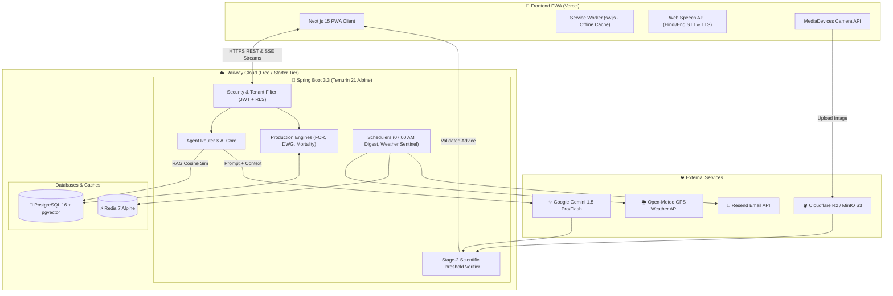

# 🌾 AgriFarmAssistant (कृषि-फार्म सहायक)

> **Next-Generation Autonomous Precision Agriculture, Fisheries & Poultry Operating System**  
> Powered by Next.js 15 PWA, Spring Boot 3.3 (Java 21), PostgreSQL (pgvector), 4-Agent ICAR-certified AI Core, and Redis.

---

## 🌟 Executive Summary

**AgriFarmAssistant** is an enterprise-grade, mobile-first Progressive Web Application (PWA) and backend platform built for small-to-large-scale farmers across India and global developing agricultural economies. It unifies **Fisheries**, **Poultry Management**, and **Integrated Crop-Livestock Farming** into a single platform backed by authentic scientific protocols from **ICAR-CIFA** (Central Institute of Freshwater Aquaculture) and **ICAR-CARI** (Central Avian Research Institute).

The platform features:
- **Zero-Password Authentication**: Instant, reliable 6-digit Email OTP login (no SMS gateway failures or costs).
- **Safe Mortality & Biological Engines**: Guaranteed mathematical constraints preventing negative poultry counts, with automated Daily Weight Gain (DWG), Specific Growth Rate (SGR), and Feed Conversion Ratio (FCR) analytics.
- **4-Agent Multi-AI Core**: Cascading Gemini LLM architecture verified against hard scientific threshold tables before any advice reaches the farmer.
- **Nocturnal Hypoxia & Weather Sentinel**: Predicts midnight dissolved oxygen crashes in fish ponds and extreme poultry heat stress using live GPS weather telemetry.
- **Bilingual Accessibility**: 100% native Devanagari Hindi and English localization with real-time speech input/output.

---

## 🏗️ Target Production Tech Stack

| Layer | Technology | Deployment Platform | Notes |
| :--- | :--- | :--- | :--- |
| **Frontend PWA** | Next.js 15 (App Router), React 19, Tailwind CSS, shadcn/ui | **Vercel** | Edge Network, Service Worker offline caching, mobile bottom bar |
| **Backend API** | Spring Boot 3.3, Java 21 LTS, Spring Security, Spring AI | **Railway** | Containerized with Eclipse Temurin 21 Alpine, stateless JWT |
| **Relational Database** | PostgreSQL 16 + `pgvector` extension | **Railway Database** | HNSW index vector store, multi-tenant row-level isolation |
| **Cache & Queue** | Redis 7 Alpine | **Railway Redis** | 30-min weather TTL, Mandi cache, rate limiting, OTP tokens |
| **Object Storage** | MinIO / Cloudflare R2 (S3-compatible) | **Cloudflare R2 / Railway** | Lesion photos, lab reports, generated loan PDFs |
| **RAG & ETL Worker** | Python 3.11, LangChain, PyPDF, Psycopg2 | **Railway Worker / Local** | ICAR manual parsing & knowledge vector ingestion |
| **Email Sentinel** | Resend API / JavaMailSender | **Resend** | 07:00 AM daily digest & instant hypoxia/storm alerts |

---

## 🎯 20 Core Feature Alignment Matrix

| # | Feature Name | Backend Module | Frontend Route / Component | Documentation |
| :-: | :--- | :--- | :--- | :--- |
| **1** | **Email OTP Auth & Multi-Tenant** | `modules/auth/`, `TenantContextFilter.java` | `/login`, `app/login/page.tsx` | [`API_SPECIFICATION.md`](docs/API_SPECIFICATION.md#1-authentication-endpoints) |
| **2** | **Multi-Farm GPS Management** | `modules/farm/FarmService.java` | `/dashboard`, `hooks/useGeolocation.ts` | [`SYSTEM_ARCHITECTURE.md`](docs/SYSTEM_ARCHITECTURE.md#multi-tenant-data-isolation) |
| **3** | **Fisheries & Species Hub** | `modules/fisheries/FisheriesService.java` | `/fisheries`, `[pondId]/page.tsx` | [`SCIENTIFIC_THRESHOLDS.md`](docs/SCIENTIFIC_THRESHOLDS.md#icar-cifa-fisheries-standards) |
| **4** | **Poultry Batch Management** | `modules/poultry/PoultryService.java` | `/poultry`, `[poultryId]/page.tsx` | [`SCIENTIFIC_THRESHOLDS.md`](docs/SCIENTIFIC_THRESHOLDS.md#icar-cari-poultry-standards) |
| **5** | **Biological Growth, DWG, SGR** | `modules/growth/GrowthCalculationService.java` | `components/gauges/GrowthProgressRing.tsx` | [`SCIENTIFIC_THRESHOLDS.md`](docs/SCIENTIFIC_THRESHOLDS.md#growth--feed-mathematical-formulas) |
| **6** | **Feed Engine, FCR & Forecast** | `modules/feeding/FeedingEngineService.java` | `/fisheries/feeding`, `FcrComparisonChart.tsx` | [`SCIENTIFIC_THRESHOLDS.md`](docs/SCIENTIFIC_THRESHOLDS.md#growth--feed-mathematical-formulas) |
| **7** | **Safe Mortality Engine** | `modules/mortality/SafeMortalityService.java` | `/fisheries/[pondId]`, `/poultry/[poultryId]` | [`SYSTEM_ARCHITECTURE.md`](docs/SYSTEM_ARCHITECTURE.md#safe-mortality--stock-concurrency-engine) |
| **8** | **Water Quality Telemetry** | `modules/waterquality/WaterQualityService.java` | `/water-telemetry`, `WaterQualityGauge.tsx` | [`SCIENTIFIC_THRESHOLDS.md`](docs/SCIENTIFIC_THRESHOLDS.md#water-quality-critical-threshold-matrix) |
| **9** | **Health & Treatment Log** | `modules/health/HealthTreatmentService.java` | Clinical observation dialogs & withdrawal alerts | [`API_SPECIFICATION.md`](docs/API_SPECIFICATION.md#9-clinical-health--treatment-endpoints) |
| **10** | **Poultry Vaccination Calendar** | `modules/poultry/VaccinationService.java` | `/poultry/vaccines`, Vaccine reminders | [`SCIENTIFIC_THRESHOLDS.md`](docs/SCIENTIFIC_THRESHOLDS.md#national-poultry-vaccination-protocol-india) |
| **11** | **Farm Financials & COP/kg** | `modules/finance/FinanceService.java` | `/financials`, Cost per kg harvested biomass | [`API_SPECIFICATION.md`](docs/API_SPECIFICATION.md#11-financials--cost-of-production) |
| **12** | **4-Agent ICAR Multi-AI Core** | `modules/ai/agents/`, `Stage2VerificationLayer.java` | `/advisory`, `IcarCitationFootnote.tsx` | [`SYSTEM_ARCHITECTURE.md`](docs/SYSTEM_ARCHITECTURE.md#4-agent-icar-multi-ai-core) |
| **13** | **Vision Disease Scanner** | `modules/ai/vision/DiseaseVisionService.java` | `/disease-doctor`, `CameraCaptureModal.tsx` | [`SYSTEM_ARCHITECTURE.md`](docs/SYSTEM_ARCHITECTURE.md#vision-disease-scanner-pipeline) |
| **14** | **Voice Assistant (Hindi/Eng)** | `modules/ai/voice/VoiceTranscriptionService.java` | `VoiceWaveform.tsx`, `useVoiceAssistant.ts` | [`API_SPECIFICATION.md`](docs/API_SPECIFICATION.md#12-ai-advisory--telemetry-endpoints) |
| **15** | **Weather & Hypoxia Sentinel** | `modules/weather/NocturnalHypoxiaPredictor.java` | `/weather-sentinel`, `WeatherHypoxiaChart.tsx` | [`SYSTEM_ARCHITECTURE.md`](docs/SYSTEM_ARCHITECTURE.md#telemetry-risk--weather-sentinel) |
| **16** | **07:00 AM Email Sentinel** | `modules/email/MorningDigestScheduler.java` | `/settings`, Bilingual email notification engine | [`DEPLOYMENT_GUIDE.md`](docs/DEPLOYMENT_GUIDE.md#step-5-configure-email-sentinel-resend) |
| **17** | **Reports & Subsidy Exports** | `modules/reports/FarmReportExportService.java` | `/reports`, PDF Bank Loan & Subsidy generator | [`API_SPECIFICATION.md`](docs/API_SPECIFICATION.md#13-farm-reports--exports) |
| **18** | **Tasks Checklist & In-App Alerts**| `modules/tasks/TaskAlertService.java` | `DailyChecklistWidget.tsx`, `SeverityAlertBanner.tsx` | [`API_SPECIFICATION.md`](docs/API_SPECIFICATION.md#14-tasks--in-app-alerts) |
| **19** | **100% Hindi/English i18n** | Bilingual DB/Email Templates & STT/TTS | `i18n/hi.json`, `i18n/en.json`, `useLanguage.ts` | [`SYSTEM_ARCHITECTURE.md`](docs/SYSTEM_ARCHITECTURE.md#frontend-pwa-architecture) |
| **20** | **UI/UX Themes & Mobile Nav** | Domain metadata served via REST APIs | `MobileBottomBar.tsx`, `domain-themes/` | [`SYSTEM_ARCHITECTURE.md`](docs/SYSTEM_ARCHITECTURE.md#frontend-pwa-architecture) |

---

## 🏛️ High-Level System Architecture



---

## 🚀 Quick Start Guide

### 1. Prerequisites
- **Node.js**: v20.x or v22.x LTS
- **JDK**: Eclipse Temurin 21 LTS
- **Docker & Docker Compose**: (For local database and Redis)
- **Git**: Latest version

### 2. Clone and Setup Environment
```bash
git clone https://github.com/your-username/agrifarm-assistant.git
cd agrifarm-assistant

# Copy example environment configuration
cp .env.example .env
```

### 3. Start Infrastructure via Docker Compose (Local Dev)
```bash
docker compose -f docker/docker-compose.yml up -d
```
This boots up:
- PostgreSQL 16 on port `5432` with `vector` extension pre-loaded
- Redis 7 on port `6379`
- MinIO S3 on port `9000` (Console on port `9001`)

### 4. Run Spring Boot Backend
```bash
cd agrifarm-backend
./mvnw clean spring-boot:run -Dspring-boot.run.profiles=dev
```
Backend will start on `http://localhost:8080`. Flyway migrations will execute automatically.

### 5. Run Next.js 15 PWA Frontend
```bash
cd ../agrifarm-frontend
npm install
npm run dev
```
Frontend will be accessible at `http://localhost:3000`.

---

## ☁️ Deployment Summary (Vercel + Railway)

- **Frontend (Next.js 15)**: Deployed to **Vercel** with zero-configuration Edge deployment, Next.js App Router streaming support, and PWA capabilities. See [`DEPLOYMENT_GUIDE.md`](docs/DEPLOYMENT_GUIDE.md#frontend-deployment-on-vercel) for step-by-step instructions.
- **Backend (Spring Boot 3.3)**: Deployed to **Railway** using standard multi-stage Alpine Dockerfile optimized for low memory usage (`-XX:MaxRAMPercentage=75`).
- **PostgreSQL & Redis**: Provisioned directly on Railway with 1-click plugins, pre-enabling `pgvector`.
- **Blob Storage**: Uses **Cloudflare R2** (10 GB free tier) or containerized MinIO for image diagnostics.

---

## 📚 Documentation Deep Dives

1. **[System Architecture & Data Flows](docs/SYSTEM_ARCHITECTURE.md)**: Multi-Agent design, Stage-2 Verification, Safe Decrement Engine, and PWA Service Worker caching.
2. **[Scientific Thresholds & ICAR Protocols](docs/SCIENTIFIC_THRESHOLDS.md)**: ICAR-CIFA carp fisheries standards, ICAR-CARI poultry standards, water quality matrices, and disease formulas.
3. **[API Specification & OpenAPI Documentation](docs/API_SPECIFICATION.md)**: Full REST & SSE API contract across all 20 modules.
4. **[Deployment Guide (Vercel & Railway)](docs/DEPLOYMENT_GUIDE.md)**: Complete guide to provisioning on Vercel and Railway's free/starter tiers with zero surprise costs.

---

## 🛡️ License & Acknowledgements

- **Scientific Backing**: Derived from open research published by the **Indian Council of Agricultural Research (ICAR)**, **CIFA Bhubaneswar**, and **CARI Izatnagar**.
- **License**: MIT Open Source License.
