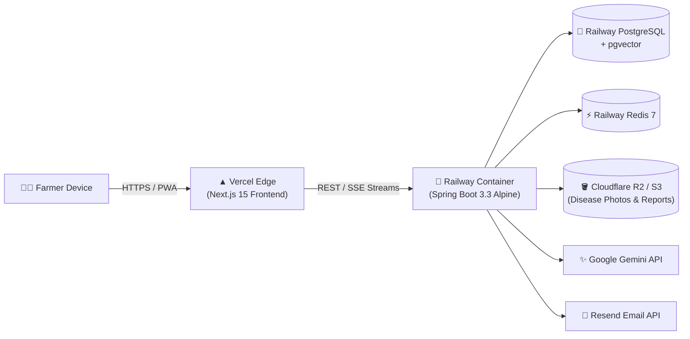

# 🚀 AgriFarmAssistant: Production Deployment Guide

> **Target Architecture**:  
> - **Frontend (Next.js 15 PWA)**: Hosted on **Vercel** (Global Edge CDN)  
> - **Backend (Spring Boot 3.3)**: Hosted on **Railway** (Free / Starter Tier Container)  
> - **Database & Cache**: Managed **PostgreSQL 16 (with pgvector)** and **Redis 7** on Railway  
> - **Object Storage**: **Cloudflare R2** (S3-compatible, 10 GB free tier) or containerized MinIO

---

## 📋 Architecture & Resource Allocation



---

## Part 1: Railway Backend Deployment (Free / Starter Tier)

Railway provides a reliable environment with native PostgreSQL, Redis, and Docker deployment.

### Step 1: Create a Railway Project & Provision Databases

1. Log into your [Railway Dashboard](https://railway.app/).
2. Click **New Project** $\to$ **Provision PostgreSQL**.
   - Once provisioned, click on the Postgres card $\to$ **Connect** $\to$ open the **Query** tab.
   - Execute the following command to enable the vector extension:
     ```sql
     CREATE EXTENSION IF NOT EXISTS vector;
     ```
3. In the same project, click **+ New** $\to$ **Database** $\to$ **Add Redis**.

---

### Step 2: Configure Spring Boot JVM for Railway Memory Limits

> [!IMPORTANT]
> Railway's free/starter tier provides 512 MB to 1 GB of RAM. The JVM must be instructed not to exceed the container memory limit to prevent Railway from killing the process with an Out-of-Memory (OOM) exit code 137.

In your `Dockerfile.backend` or Railway service settings, set the JVM flags:
```dockerfile
# Multi-stage Dockerfile for Railway
FROM eclipse-temurin:21-jdk-alpine AS builder
WORKDIR /workspace
COPY pom.xml mvnw ./
COPY .mvn .mvn
RUN ./mvnw dependency:go-offline -B
COPY src src
RUN ./mvnw package -DskipTests

FROM eclipse-temurin:21-jre-alpine
WORKDIR /app
COPY --from=builder /workspace/target/*.jar app.jar
EXPOSE 8080
# Critical memory flags for Railway free tier:
ENV JAVA_OPTS="-XX:+UseSerialGC -XX:MaxRAMPercentage=75 -Xss512k -Djava.security.egd=file:/dev/./urandom"
ENTRYPOINT ["sh", "-c", "java $JAVA_OPTS -jar app.jar"]
```

---

### Step 3: Deploy the Backend Service on Railway

1. In your Railway Project, click **+ New** $\to$ **GitHub Repo**.
2. Select your `agrifarm-assistant` repository.
3. In the service settings:
   - **Root Directory**: `agrifarm-backend`
   - **Build Command**: Leave default or specify `./mvnw clean package -DskipTests`
4. Set the **Environment Variables** in the Railway Dashboard:

| Variable Name | Value Source / Example | Purpose |
| :--- | :--- | :--- |
| `SPRING_PROFILES_ACTIVE` | `prod` | Activates production configuration |
| `SPRING_DATASOURCE_URL` | `${{Postgres.DATABASE_URL}}` | Auto-linked from Railway Postgres |
| `SPRING_DATA_REDIS_URL` | `${{Redis.REDIS_URL}}` | Auto-linked from Railway Redis |
| `SPRING_AI_GEMINI_API_KEY` | `AIzaSy...` | Google Gemini API key for 4-Agent Core |
| `RESEND_API_KEY` | `re_...` | For zero-SMS Email OTP and daily alerts |
| `JWT_SECRET` | `4a8f9c12e73b50d8...` *(64+ hex characters)* | Cryptographic signing key |
| `CORS_ALLOWED_ORIGINS` | `https://your-app.vercel.app` | Vercel production frontend domain |
| `S3_ENDPOINT` | `https://<account-id>.r2.cloudflarestorage.com` | Cloudflare R2 endpoint |
| `S3_BUCKET_NAME` | `agrifarm-storage` | S3 bucket for disease images |
| `S3_ACCESS_KEY` | `your-r2-access-key` | Cloudflare R2 access key |
| `S3_SECRET_KEY` | `your-r2-secret-key` | Cloudflare R2 secret key |

5. Under **Settings** $\to$ **Networking**, click **Generate Public Domain**.  
   *Your backend is now live at: `https://agrifarm-backend-production.up.railway.app`*

---

## Part 2: Vercel Frontend Deployment (Next.js 15 PWA)

Vercel provides native optimization for Next.js 15 App Router, Image Optimization, and Edge caching.

### Step 1: Push Frontend to GitHub & Import into Vercel

1. Log into your [Vercel Dashboard](https://vercel.com/).
2. Click **Add New...** $\to$ **Project**.
3. Import your GitHub repository.
4. In the Project Configuration:
   - **Root Directory**: Select `agrifarm-frontend`
   - **Framework Preset**: `Next.js`
   - **Build Command**: `npm run build`
   - **Output Directory**: `.next`

---

### Step 2: Configure Vercel Environment Variables

In the Vercel project configuration, add the following under **Environment Variables**:

| Variable Name | Target Value | Description |
| :--- | :--- | :--- |
| `NEXT_PUBLIC_API_URL` | `https://agrifarm-backend-production.up.railway.app/api/v1` | Points to your Railway API |
| `NEXT_PUBLIC_APP_ENV` | `production` | Enables production telemetry |
| `NEXT_PUBLIC_DEFAULT_LOCALE`| `hi` | Sets default language to Hindi |

---

### Step 3: Configure PWA Headers & Permissions in `next.config.ts`

Ensure your `agrifarm-frontend/next.config.ts` allows camera and microphone access for the Vision Scanner and Voice Assistant:

```typescript
import type { NextConfig } from "next";

const nextConfig: NextConfig = {
  reactStrictMode: true,
  // Ensure headers permit camera & microphone for PWA on Mobile
  async headers() {
    return [
      {
        source: "/(.*)",
        headers: [
          {
            key: "Permissions-Policy",
            value: "camera=(self), microphone=(self), geolocation=(self)"
          },
          {
            key: "X-Content-Type-Options",
            value: "nosniff"
          },
          {
            key: "X-Frame-Options",
            value: "DENY"
          }
        ]
      }
    ];
  }
};

export default nextConfig;
```

---

## Part 3: Free-Tier Storage Setup (Cloudflare R2)

MinIO running inside a container on Railway consumes memory. **Cloudflare R2** is S3-compatible and offers **10 GB free storage with zero egress fees**, making it ideal for the free tier.

1. Create a free account at [Cloudflare](https://dash.cloudflare.com/).
2. Go to **R2 Object Storage** $\to$ **Create Bucket** $\to$ name it `agrifarm-storage`.
3. In bucket settings, click **Manage R2 API Tokens** $\to$ **Create API Token** (Read & Write permissions).
4. Copy the `Access Key ID`, `Secret Access Key`, and `Endpoint URL` into Railway's environment variables.

---

## Part 4: Post-Deployment Smoke Test Checklist

Once both Vercel and Railway are running:

- [ ] **Email OTP Flow**: Visit `https://your-app.vercel.app/login`, enter your email, verify OTP is received via Resend within 5 seconds and successfully logs into the dashboard.
- [ ] **Multi-Tenant GPS**: Allow browser location access; confirm latitude and longitude are correctly stamped on farm creation.
- [ ] **Stock Underflow Check**: Attempt to record 999 mortalities on an empty poultry batch; confirm backend returns HTTP 409 `STOCK_UNDERFLOW_ERROR`.
- [ ] **SSE Streaming Advisory**: Send a question in the AI Advisory tab; verify tokens stream in character-by-character with ICAR citations.
- [ ] **PWA Offline Shell**: Turn off Wi-Fi/Mobile data; confirm the app shell and cached ICAR manuals load cleanly without a broken network page.
